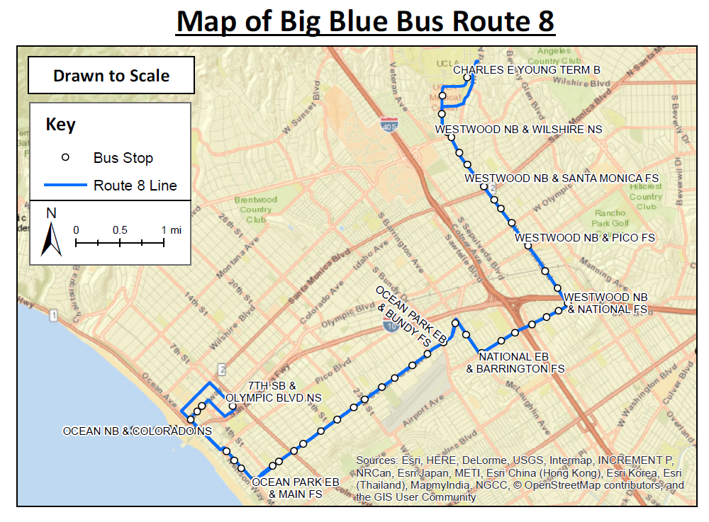
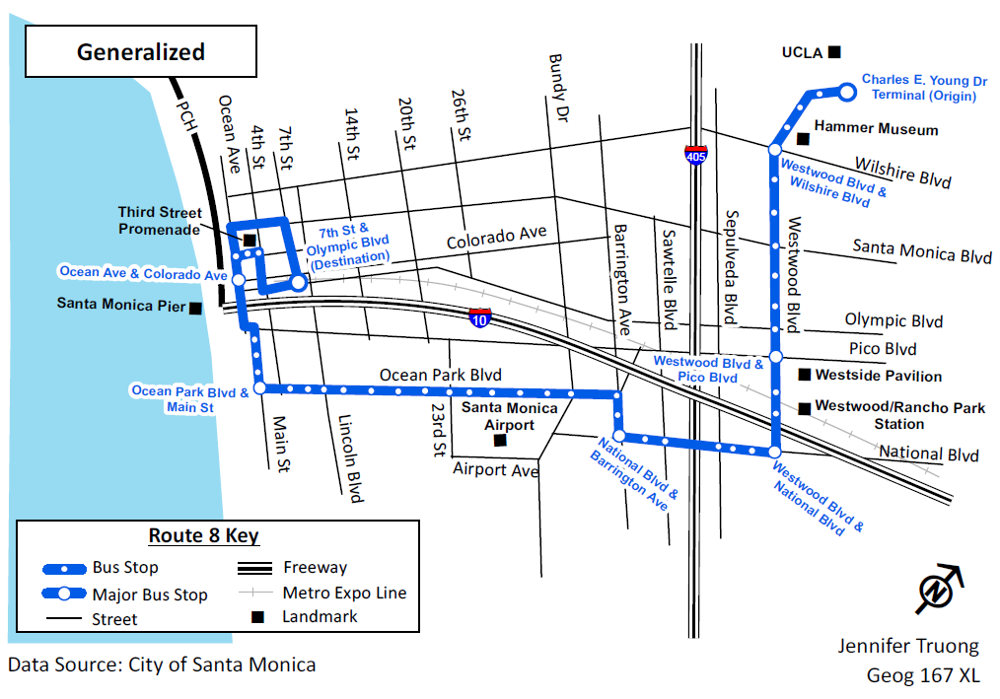

When I traveled internationally (by internationally, I meant outside of America), a feature that caught my attention during my trips was the colorful public transit map that appeared every block or so. London's Underground and Paris' Metro transit maps guided my way through unfamiliar urban territories during my study abroad trip in the summer of 2013. Tokyo's railway systems looked so neat, organized, and colorful on their maps that it helped distract me from the busy rush hour traffic and frantic tourists during the 2017 cherry blossom season.

(insert maps of London, Paris, and Tokyo subways here)

I had a chance to create a generalized transit map of *my own* as a class assignment for my cartography class in the GIS Certificate program at UCLA Extension. Our task was to pick one of the routes from the Santa Monica Big Blue Bus (SMBBB) and re-draw them in two ways: one drawn to scale and the other as *generalized*. Creating the first map was simple enough at the time.

On the other hand, creating a generalized map was nervewrecking at first. How does one create a map without existing shapefiles or auto-labeling lines and points?

After extensive clicking on the Draw toolbar, tinkering with line symbology, and adjusting text labels, it was done. I was surprised by how clean it turned out. At least the route did not look like a maze, and it made sense where the buses on the route would normally go.