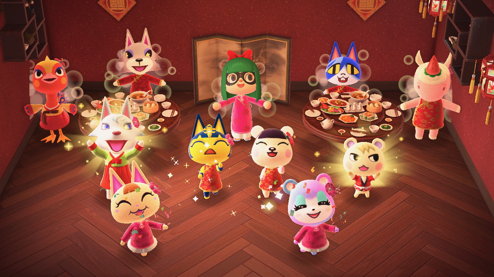
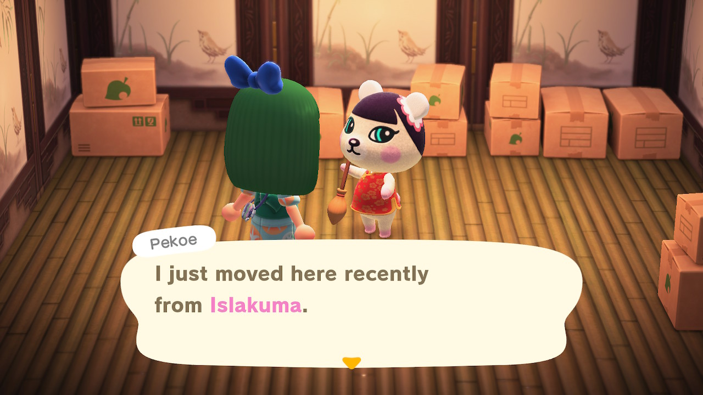
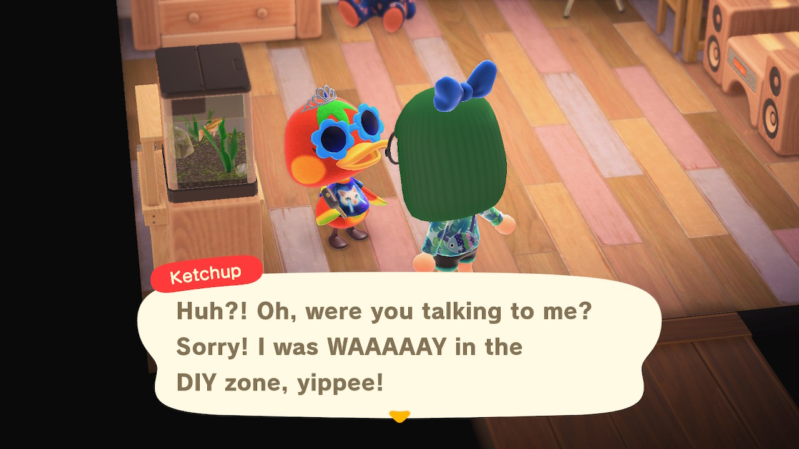
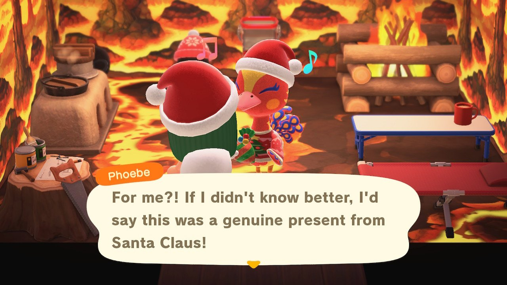
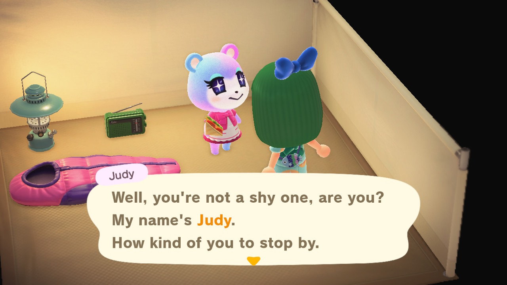
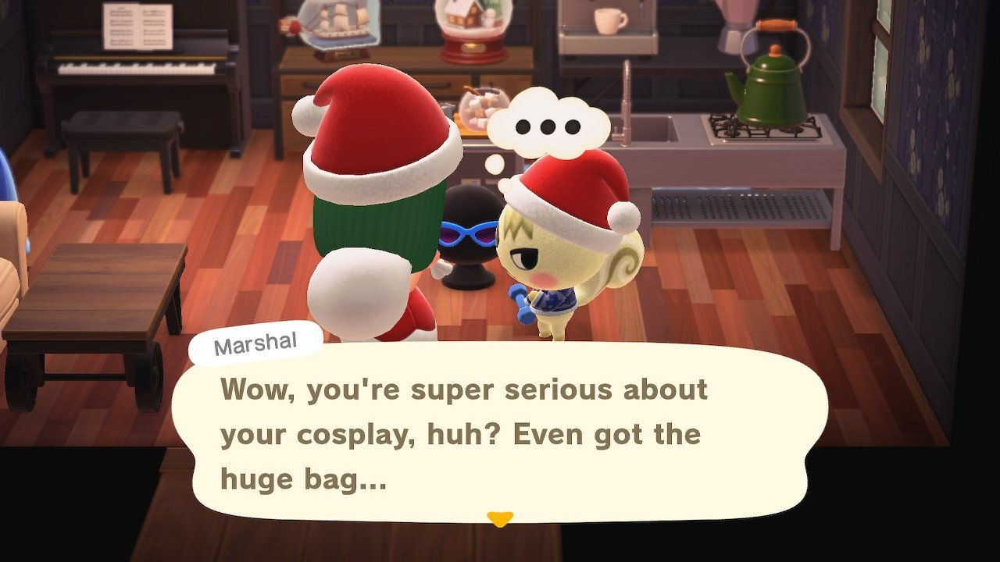
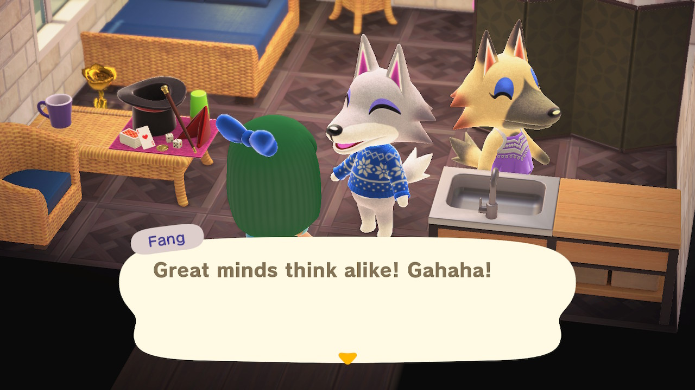
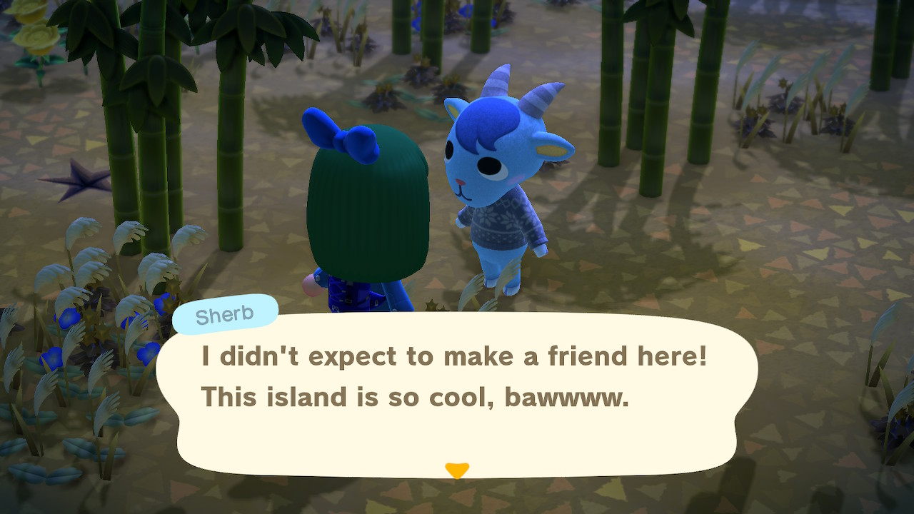
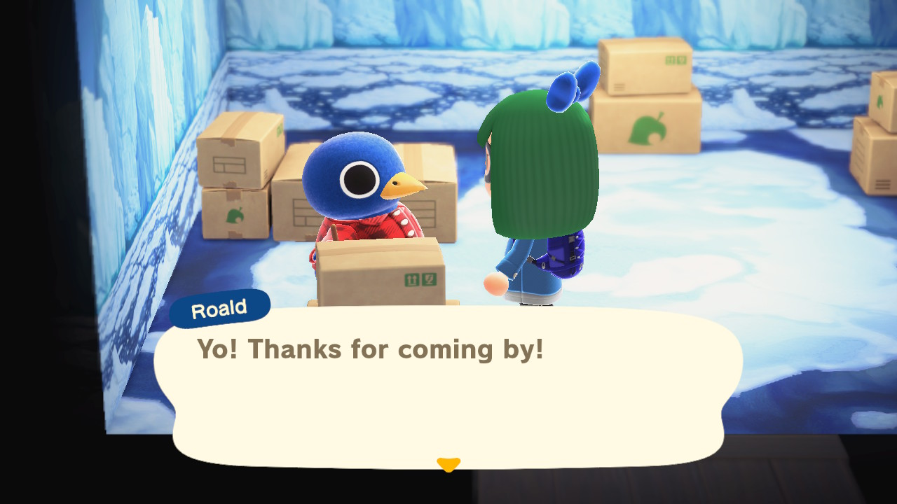

```{r setup, include=FALSE}
knitr::opts_chunk$set(echo = TRUE)

# Attach packages ----

library(tidyverse)
library(janitor)
library(here)
library(forcats) # for factor variables
library(cowplot)
#library(magick)

theme_set(theme_cowplot())
```

```{r Reading in ACNH Data}

# Get the Data

critic <- readr::read_tsv('https://raw.githubusercontent.com/rfordatascience/tidytuesday/master/data/2020/2020-05-05/critic.tsv')
user_reviews <- readr::read_tsv('https://raw.githubusercontent.com/rfordatascience/tidytuesday/master/data/2020/2020-05-05/user_reviews.tsv')
items <- readr::read_csv('https://raw.githubusercontent.com/rfordatascience/tidytuesday/master/data/2020/2020-05-05/items.csv')
villagers <- readr::read_csv('https://raw.githubusercontent.com/rfordatascience/tidytuesday/master/data/2020/2020-05-05/villagers.csv')

# I'll probably just focus on the villagers data though
```

## About the Data

During Tidy Tuesday in May 2020, one of the datasets was based on *Animal Crossing: New Horizons* (ACNH), one of Nintendo's popular franchises that took off at the beginning of the pandemic. Having played the game since its release, I was interested in doing some fun data visualization of the many villagers featured in the game. 

**Data source:** https://github.com/rfordatascience/tidytuesday/tree/master/data/2020/2020-05-05

```{r Wrangling with villager types}

villager_count <- villagers %>%
  group_by(personality) %>% # Group by personality
  count() %>% # Count by personality
  arrange(-n) # Arrange from most villagers to least

# Change personality column to factor
villager_fct <- villager_count %>%
  mutate(personality = as_factor(personality))

# Change factor levels to based on frequncy
villager_by_freq <- villager_fct %>%
  mutate(personality = fct_infreq(personality))

#Check level
levels(villager_by_freq$personality)  
```

## ACNH Villager Personalities

### Female Villagers

#### Normal



A normal villager is nice most of the time. She will often comment on the tidiness of her house and her clothes. She rarely gets upset but can be very kind. She worries about nothing other than hygiene and tidiness. The normal villager loves clothes shopping and may ask for the player to get certain clothes for a small reward.  

**Data source:** https://nookipedia.com/wiki/Normal

#### Peppy



A peppy villager appears energetic and unusually excited when seeing the player and most other villagers. She also appears childish and immature, saying stereotypical "girly" words such as "totally", "sooo" and "like", as in "This is, like, cool!" She is also also excessively kind, usually asking the player for items they want. She gets along well with other villagers, particularly the lazy, normal, big sister, smug and other peppy villagers, but she has the tendency to annoy and upset cranky and snooty villagers, who are known to appear older and more mature than other villagers. Due to her honest nature, the peppy villager may mention how "old" or "boring" they are, in contrast to her energetic, upbeat personality. She easily gets upset in conversation when it is not going her way, but will forget ever having the conversation due to her short attention span. 

**Data source:** https://nookipedia.com/wiki/Peppy

#### Sisterly (Uchi)



A big sister (or sisterly) villager will act similar to a snooty villager, but she will act kinder to the player, especially in the sense that she dislikes rumors. She gets along with most villager personalities, but will disagree with cranky and snooty villagers sometimes because they spread rumors. She may talk about gardening and cooking frequently, but the other villagers may question her expertise. If the player gets stung by a Bee, she will supply medicine. 

**Data source:** https://nookipedia.com/wiki/Big_sister

#### Snooty



A snooty villager will appear arrogant and snobbish towards the player and other villagers, but will appear friendly and nice in some discussions, provided they are mature and do not insult her lifestyle. She finds appearance important, and will get angry or upset if someone criticizes her sense of style or fitness, which means a conversation between her and a jock personality may leave either one upset or angry. Her attitude towards the player changes, as she begins to warm up to them, but she will still retain some arrogance and subtle rudeness. She may not get along with lazy villagers, due to their lifestyles - lazy villagers having a strong interest in food or relaxing, both of which will make her uncomfortable, angry, and upset when in conversation. She will upset peppy villagers, usually by gossiping about them, and finding small things to judge them on. She will get along well with normal, cranky, and other snooty villagers. 

**Data source:** https://nookipedia.com/wiki/Snooty

### Male Villagers

#### Smug



A smug villager will not find it hard to converse with other villagers, as he is very polite and lively. He also may be seen flirting with the player, regardless of their gender. He may sometimes appear conceited when talking to himself. Some of his hobbies include dancing and singing. He will appear enthusiastic when going to the player's house. 

**Data source:** https://nookipedia.com/wiki/Smug

#### Cranky



A cranky villager will appear mature compared to other personality types. This will make him appear belittling and insensitive to other villagers, including the player. Despite this, he will learn to confide in the player, considering them his only friend. He will enjoy the usual hobbies, but for relaxation and peace than competition. He will find it difficult to socialize with peppy villagers, who he will criticize when talking to other villagers. He will get along with normal and snooty villagers, as well as other cranky villagers, who he will share deeper conversations with, and will also admire lazy villagers for their lifestyle. He will, on occasion, annoy a normal villager, usually when being mean about something or someone.

**Data source:** https://nookipedia.com/wiki/Cranky

#### Lazy



A lazy villager has a relaxed, laid-back lifestyle and will appear friendly toward the player. He often talks about food and is humorous or naïve during conversations. During conversations with other villagers, he generally gets along well with peppy, smug, and cranky villagers, while snooty and jock villagers may not get along with him due to their conflicting lifestyles.

**Data source:** https://nookipedia.com/wiki/Lazy

#### Jock



A jock villager is energetic and has an interest in physical fitness and activity. He often talks about exercise or sports and may brag about his physical fitness. While often friendly to the player, he may comment on their fitness. During conversations with other villagers, he generally gets along well with peppy villagers due their similar hyper personalities and will also get along with smug villagers, while he may offend snooty villagers by critiquing their fitness and annoy cranky villagers with his hyper personality. 

**Data source:** https://nookipedia.com/wiki/Jock

## Villager Graph

```{r Villager graph}

acnh_graph <- ggplot(data = villager_by_freq, 
           aes(x = fct_reorder(personality, n), # Reorder personality (x variable) by count
               y = n)) + 
  geom_bar(aes(fill = personality), # Change fill color of bars by personality type
            stat = "identity", # Use count as y variable
            show.legend = FALSE) + # Don't show legend
  labs(x = "Villager Personality", # Change axis titles
       y = "Number of Villagers",
       title = "ACNH Villager Personalities", # Give graph title
       subtitle = "Which villager personality is the most abundant?",
       caption = "Data: VillagerDB \n Viz: @jenjentro") + 
  scale_fill_brewer(palette = "Dark2") + # Change fill colors of histogram bars
  geom_text(aes(label = n), # Add data labels for villager count
            color = "white", # Change font color to white
            hjust = 1.5) + # Adjust position of labels on actual bars
  scale_y_continuous(expand = c(0, 0)) + # Extend plot to start at 0
  coord_flip() + # Flip x and y axes
  theme_classic() + # Change appearance of graph
  theme(
    plot.title = element_text(hjust = 0.5), # Move graph title to center
    plot.subtitle = element_text(hjust = 0.5, face = "italic") # Move subtitle to center, put in italics
  )

```

```{r, fig.cap="Total count of ACNH villagers per personality types!"}

ggdraw() + 
    draw_plot(acnh_graph) +
    draw_image(villagers$url[villagers$name == "Anchovy"], # Get pic for lazy villager
               x = 0.10, 
               y = 0.81, 
               width = 0.12, 
               height = 0.12) +
    draw_image(villagers$url[villagers$name == "Celia"], # Get pic for normal villager
               x = 0.10, 
               y = 0.71, 
               width = 0.12, 
               height = 0.12) +
    draw_image(villagers$url[villagers$name == "Vivian"], # Get pic for snooty villager
               x = 0.10, 
               y = 0.61, 
               width = 0.12, 
               height = 0.12) +
    draw_image(villagers$url[villagers$name == "Goose"], # Get pic for jock villager
               x = 0.10, 
               y = 0.51, 
               width = 0.12, 
               height = 0.12) +
    draw_image(villagers$url[villagers$name == "Vic"], # Get pic for cranky villager 
               x = 0.10, 
               y = 0.42, 
               width = 0.12, 
               height = 0.12) +
    draw_image(villagers$url[villagers$name == "Ketchup"], # Get pic for peppy villager
               x = 0.10, 
               y = 0.32, 
               width = 0.12, 
               height = 0.12) +
    draw_image(villagers$url[villagers$name == "Raymond"], # Get pic for smug villager
               x = 0.10, 
               y = 0.23, 
               width = 0.12, 
               height = 0.12) +
    draw_image(villagers$url[villagers$name == "Phoebe"], # Get pic for uchi villager
               x = 0.10, 
               y = 0.12, 
               width = 0.12, 
               height = 0.12)
  

```
