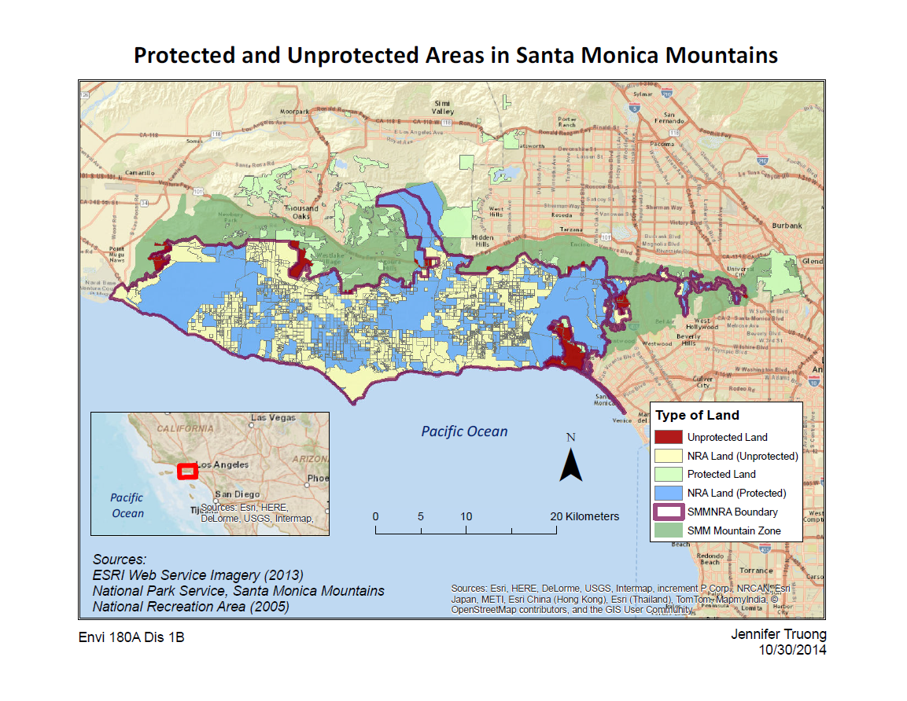
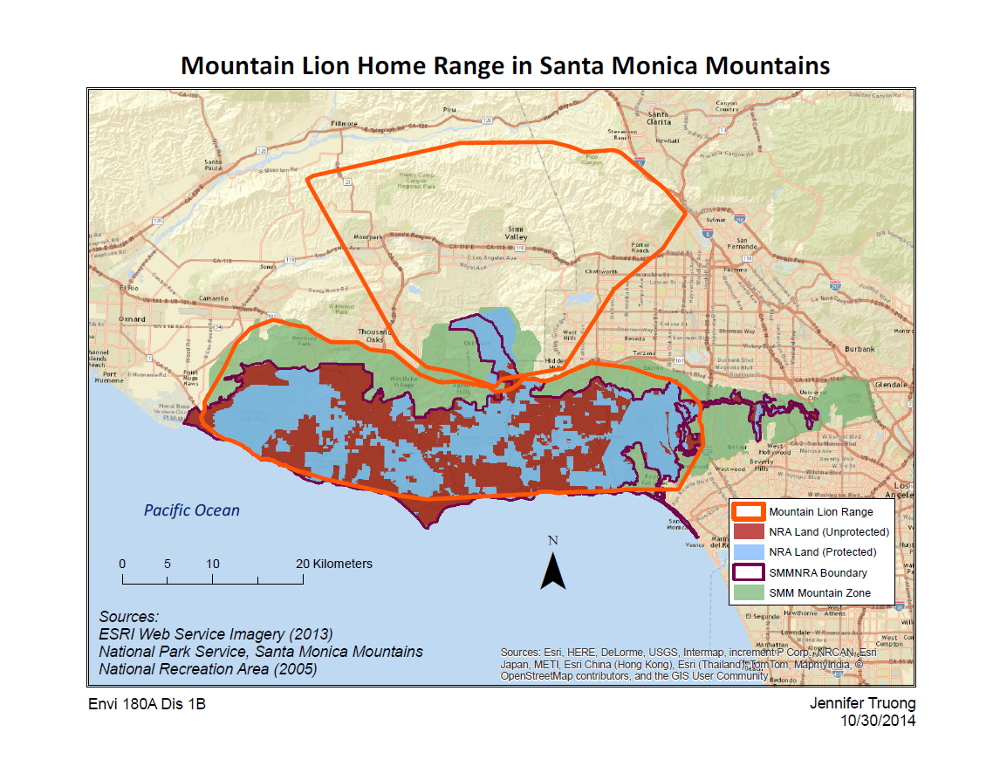
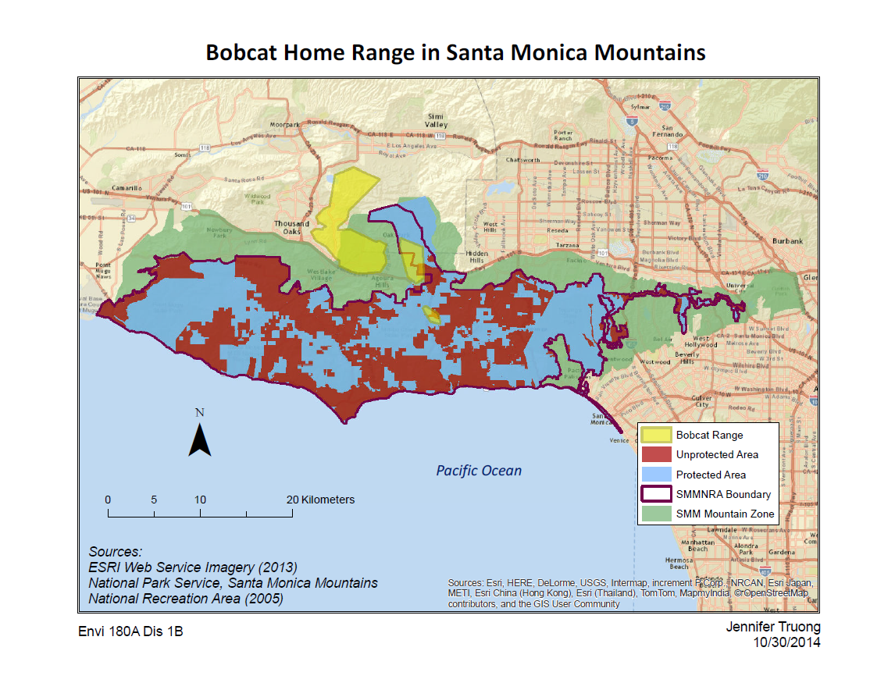

```{r setup, include=FALSE}
knitr::opts_chunk$set(echo = FALSE)

# Attach packages ----

library(tidyverse)
library(janitor)
```



These maps were one of my very first interactions with ArcGIS and GIS in general. Everyone in my class was trained through these ArcGIS workshops before we began our senior practicum project. This map of Santa Monica Mountains was part of an assignment where we learned cartography and best practices for map design. 


I also had to create additional maps for populations of local fauna near the Santa Monica Mountains, since there are active conservation projects there. The mountain lion (*Puma concolor*) is one such species of focus for these conservation projects. I highlighted their population range in orange so I could avoid clashing with the symbology for the Santa Monica Mountains. 



In this map, I tried to highlight the bobcat population (which was much smaller than the mountain lion population) with a yellow filled shapefile and reduced the opacity. Looking back at this now, I don't think this was a good idea overall since the colors are clashing against each other. Maybe if I removed the protected/unprotected area symbology, the map would be a lot simpler to read. 

Regardless of my opinons of these maps now, I'm still proud of what I did for my intial foray into GIS.