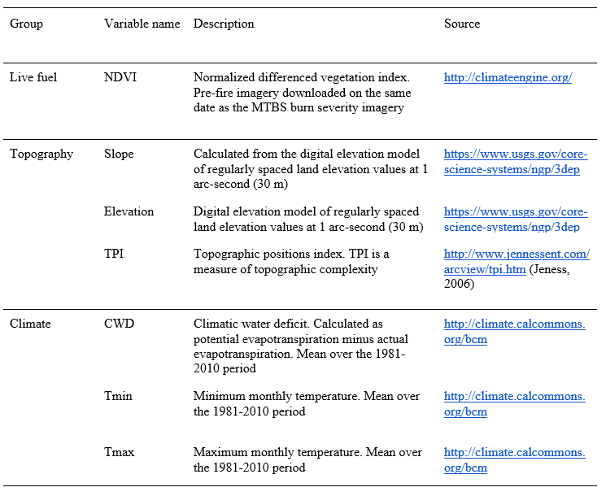
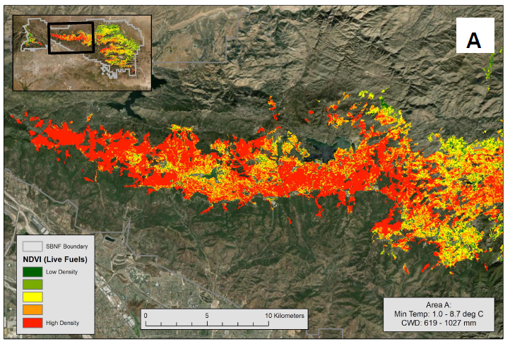
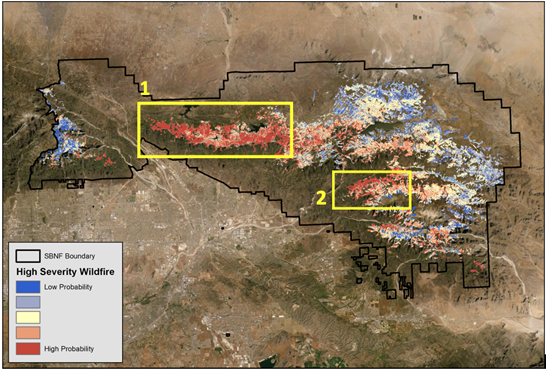

```{r setup, include=FALSE}
knitr::opts_chunk$set(echo = FALSE)

# Load packages
library(tidyverse)
library(knitr) # for table
```

For my Conservation Planning class at Bren, my final assignment was to conduct a research project to practice using conservation planning tools we learned in class. This gave me an opportunity to explore other topics about my master’s group thesis project that are outside the scope. With a partner, we asked how likely areas of high severity wildfires will occur within San Bernardino National Forests, specifically within yellow pine and mixed conifer (YPMC) forests.

We utilized a Random Forests model to find which variables are likely to be important predictor variables for fire severity. The following datasets were gathered from these sources:



I combined them into one shapefile using the **Extract Multi Values to Points** tool. I exported the attribute table as a dBase table and CSV for the input of the Random Forests model. After running the R code for the model, my partner found that NDVI and climatic water deficit (CWD) were considered to be important. I went back to our map to find areas that had high vegetation density and high CWD.



One area was in the westernmost part of San Bernardino National Forest; this area has high vegetation density. At the end of the project, we found two major areas that were predicted to have high fire severity overall.


Because this was a class assignment and it was the first time with machine learning for both of us, our Random Forests analysis was a lot simpler than we would have liked, but I still learned a lot. Now that I'm determined to pursue a career in data analysis, I may come across machine learning more often.


